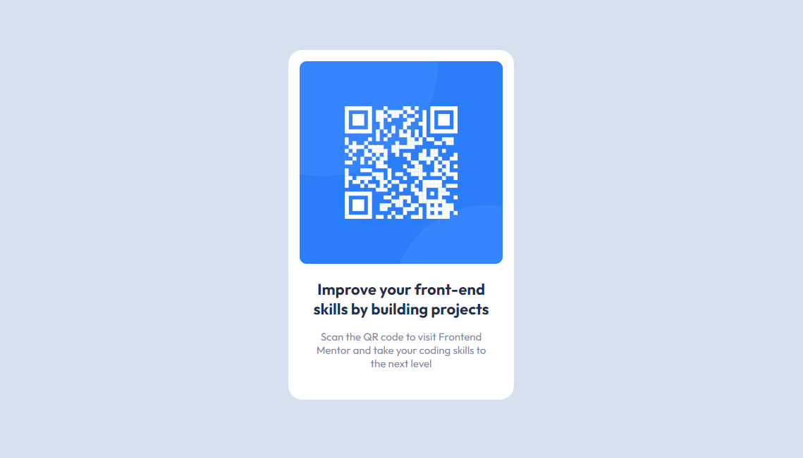

# Frontend Mentor - QR code component solution

This is a solution to the [QR code component challenge on Frontend Mentor](https://www.frontendmentor.io/challenges/qr-code-component-iux_sIO_H). Frontend Mentor challenges help you improve your coding skills by building realistic projects. 

## Table of contents

- [Frontend Mentor - QR code component solution](#frontend-mentor---qr-code-component-solution)
  - [Table of contents](#table-of-contents)
  - [Overview](#overview)
    - [Screenshot](#screenshot)
    - [Links](#links)
  - [My process](#my-process)
    - [Built with](#built-with)
    - [What I learned](#what-i-learned)
  - [Author](#author)

## Overview

### Screenshot

### Links

- Solution URL: [here](https://www.frontendmentor.io/solutions/qr-code-component-sass-Pg1tzK0mQB)
- Live Site URL: [here](https://giorgiagalbullicavazzini.github.io/qr-code-component-main/)

## My process

### Built with

- Flexbox
- [Sass](https://sass-lang.com/) - CSS pre-processor

### What I learned

It's been a while since my last front-end development session, so I decided to start working on Frontend Mentor challenges.

I wanted to start from the very beginning to make sure I covered all of the key topics again because, as previously stated, I am not as competent in front-end development as I once was, so a refresher is in order.

During this challenge, I had the opportunity to reintroduce myself to the Sass world. I hope I did it properly!

## Author

- Linkedin - [Giorgia Galbulli Cavazzini](https://www.linkedin.com/in/giorgiagalbullicavazzini/)
- Frontend Mentor - [@giorgiagalbullicavazzini](https://www.frontendmentor.io/profile/giorgiagalbullicavazzini)